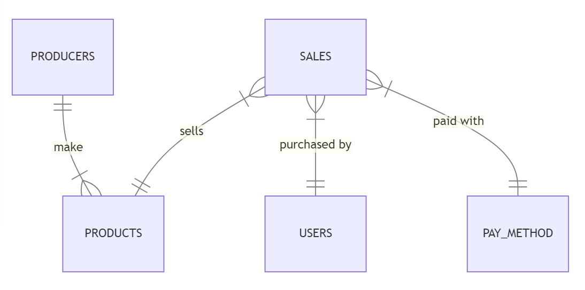

# Design Document

By Juan Ignacio Novas

Quick Sales DB

Video overview: <[Quick Sales DB Video Overview](https://youtu.be/TK8p0RC_YY8)>

## Scope

The purpose of the database is to track the sales of a small business. It would not be convenient to use it in other areas.
A big company might prefer a more detailed database, but for someone running his own shop it would be more than enough.

## Functional Requirements

The user will be able to track a complete log of sales and stock of products, while also being able to store other information such as buyer, payment method or revenue.
Users would not be able to divide the products into sections, making it harder to use if you sell many products of different types.

## Representation

### Entities

The database stores:
* Products
* Producers
* Buyers
* Pay methods
* Sales

Products have a name, a producer, a buying price, a selling price and a stock.
Producers have a name.
Buyers have a name.
Pay method have a method.
Sales have a product, a buyer, a price, an amount, a payment method and a date.

I decided to add constraints outside the PRIMERY and FOREIGN KEY only in the tables that declare a new buyer, producer, pay_method or when referring to a product and not in the rest of the database. This is because it is likely that in some cases the user of the database will prefer not to add some information because it is not certain, such as the selling price, or for some other reason. And it would be counterproductive if the user would just have to add a random character to bypass this requirement.

### Relationships

The products table has a many to one relationship with the producers table. It stores which is the producer of the product.
The Sales table has a many to one relationship with the products table. It stores which product has been sold.
The Sales table has a many to one relationship with the Users table. It stores the buyer of the product.
The Sales table has a many to one relationship with the pay method table. Storing how the product was purchased.

## Optimizations

I created 8 views, 2 indexes, and 1 trigger.

#### Views

- "in_stock" shows all products in stock and how many of them are in stock.
- "no_stock" shows all the products without stock
- "week_sales" shows the sales of the last seven days
- "day_revenue" shows the revenue of the day
- "week_revenue" shows the revenue of the week
- "month_revenue" shows the revenue of the month
- "most_selled" shows the top 5 products with the most sales in the last month
- "sales_all" shows all sales in a more user-friendly format, replacing ids with actual values.

These views simplify the most common read queries and make them simpler and easier to read.

#### Indexes

- "sales_date" an index on the sales date column
- "products_names" an index on the names of the products

The reason for the "sales_date" index is that more than half of the views use the "date" column of sales and this will speed up the process of reading this data. And the "products_name" index will help when searching for information about a specific product by its name.

#### Triggers

- "sale" When a sale is made, the stock of the product is reduced in the amount of units sold.

This trigger will facilitate the process of inserting a new sale in the database by automatically updating the "stock" column.

## Limitations

The limitation of my design is scalability. It will work very well for a small company, but a large company has more needs and a more complex design. The lack of categorization makes the analysis of the data a more difficult process when selling a wide and different type of products.
